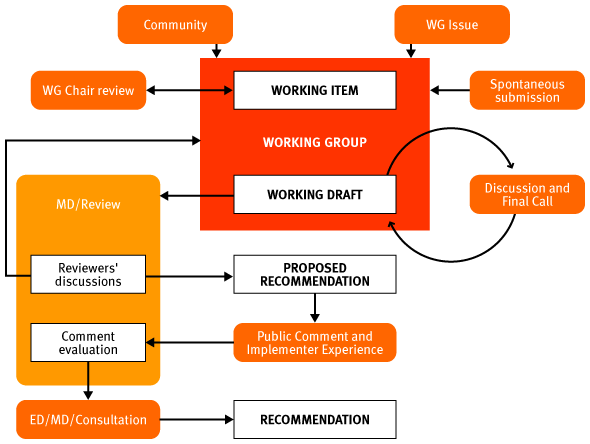

<!--#include virtual="/ssi/header.shtml" --><table summary="A layout table with descriptive information about this document." border="0" width="100%" cellspacing="0" cellpadding="2">
  <tr>
    <td align="right" valign="top" width="23%" height="30">
      
 <strong>Title:</strong> 

    </td>
    <td align="right" valign="top" width="77%" height="30">
      

        <h3>Procedure for approval of DCMI Metadata Terms and Recommendations</h3>
      

    </td>
  </tr>
  <tr>
    <td align="right" valign="top" width="23%">
      
 <strong>Creator:</strong> 

    </td>
    <td align="right" valign="top" width="77%">
      
 Makx Dekkers, <a href="mailto:mail@makxdekkers.com">mail@makxdekkers.com</a>
      

    </td>
  </tr>
  <tr>
    <td align="right" valign="top" width="23%">
      
 <strong>Date Issued:</strong> 

    </td>
    <td align="right" valign="top" width="77%">
      
 2001-06-27

    </td>
  </tr>
  <tr>
    <td align="right" valign="top" width="23%" height="22">
      
 <strong>Identifier:</strong> 

    </td>
    <td align="right" valign="top" width="77%" height="22">
      
 <a href="/usage/documents/2001/06/27/approval/">http://dublincore.org/usage/documents/2001/06/27/approval/ 
        </a>
      

    </td>
  </tr>
  <tr>
    <td align="right" valign="top" width="23%">
      
 <strong>Replaces:</strong> 

    </td>
    <td align="right" valign="top" width="77%">
      
 Not Applicable 

    </td>
  </tr>
  <tr>
    <td align="right" valign="top" width="23%">
      
 <strong>Is Replaced By:</strong> 

    </td>
    <td align="right" valign="top" width="77%">
      
 <a href="/usage/documents/2003/08/14/approval/">http://dublincore.org/usage/documents/2003/08/14/approval/</a>
      

    </td>
  </tr>
  <tr>
    <td align="right" valign="top" width="23%">
      
 <strong>Latest version:</strong> 

    </td>
    <td align="right" valign="top" width="77%">
      
 <a href="/usage/documents/approval/">http://dublincore.org/usage/documents/approval/ 
        </a>
      

    </td>
  </tr>
  <tr>
    <td width="23%" valign="top"> </td>
    <td width="77%" valign="top"> </td>
  </tr>
  <tr>
    <td valign="top" width="23%" height="82"> <strong>Description of document:</strong>
    </td>
    <td valign="top" width="77%" height="82">
      
This document lists the step by step process for the approval of DCMI 
        metadata terms and recommendations.

    </td>
  </tr>
  <tr>
    <td valign="top" colspan="2">
      

    </td>
  </tr>
</table>

&nbsp;

<table width="100%" border="1" summary="A layout table with information on the Element and Qualifier approval process.">
  <tr bgcolor="#000000">
    <td width="9%">
      <b>Step</b>
    </td>
    <td width="30%">
      <b>Event</b>
    </td>
    <td width="35%">
      <b>Action</b>
    </td>
    <td width="26%"><b>Result</b></td>
  </tr>
  <tr>
    <td width="9%">
      

        <b>1</b>
      

    </td>
    <td width="30%">Open issue is identified by the community
      and raised on a Working Group mailing list</td>
    <td width="35%">Working Group (WG) Chair creates an Open
      Issue Item and adds it to WG Open issue list</td>
    <td width="26%">Open Issue list change</td>
  </tr>
  <tr>
    <td width="9%">
      

        <b>2</b>
      

    </td>
    <td width="30%">Discussion on Working Group mailing list
      leads to proposal(s) for solution and identification of
      responsible authors/editorial team</td>
    <td width="35%">WG Chair adds the deliverable to the WG
      Task List, including authors/editorial team responsible for
      the document and a target delivery date</td>
    <td width="26%">WG Task list change</td>
  </tr>
  <tr>
    <td width="9%">
      

        <b>3</b>
      

    </td>
    <td width="30%">Authors/editorial team finalize draft
      document</td>
    <td width="35%">Authors/editorial team (in consultation
      with WG Chair) post message to WG and link document from WG
      pages</td>
    <td width="26%">DCMI Working Draft</td>
  </tr>
  <tr>
    <td width="9%">
      

        <b>41</b>
      

    </td>
    <td width="30%">WG Discussion</td>
    <td width="35%">WG Chair manages the discussion and
      iterative review and coordinates revision of proposal with
      the authors/editorial team</td>
    <td width="26%">DCMI Working Draft (revisions)</td>
  </tr>
  <tr>
    <td width="9%">
      

        <b>5</b>
      

    </td>
    <td width="30%">Consensus reached in WG</td>
    <td width="35%">WG Chair summarizes consensus and posts
      last call to DC-General</td>
    <td width="26%">DCMI Working Draft (final)</td>
  </tr>
  <tr>
    <td width="9%">
      

        <b>6</b>
      

    </td>
    <td width="30%">Resolution of all comments</td>
    <td width="35%">WG Chair submits to Managing Director</td>
    <td width="26%">DCMI WG Proposal</td>
  </tr>
  <tr>
    <td width="9%">
      

        <b>7</b>
      

    </td>
    <td width="30%">DCMI Managing Director receives DCMI WG
      Proposal</td>
    <td width="35%">DCMI Managing Director assigns WG Proposal
      to review team (Usage Board if related to Metadata Term
      Semantics or (subset of) Advisory Board plus external
      reviewers otherwise). Proposal editor needs to be closely
      involved in the review process</td>
    <td width="26%">Review team established</td>
  </tr>
  <tr>
    <td width="9%">
      

        <b>8</b>
      

    </td>
    <td width="30%">Review starts</td>
    <td width="35%">Review team chair assigns a shepherd to the
      proposal</td>
    <td width="26%">DCMI WG Proposal Review in process</td>
  </tr>
  <tr>
    <td width="9%">
      

        <b>92</b>
      

    </td>
    <td width="30%">Review team discussion</td>
    <td width="35%">Proposal shepherd manages the discussion in
      the review team</td>
    <td width="26%">Review Team discussion results</td>
  </tr>
  <tr>
    <td width="9%" rowspan="2">
      

        <b>102</b>
      

    </td>
    <td width="30%" rowspan="2">DCMI Managing Director and
      Review Team Chair evaluate Review Team discussion
      results</td>
    <td width="35%">Consensus reached</td>
    <td width="26%">Proposal becomes a DCMI Proposed
      Recommendation</td>
  </tr>
  <tr>
    <td width="35%">No consensus</td>
    <td width="26%">Proposal is referred back to the WG</td>
  </tr>
  <tr>
    <td width="9%">
      

        <b>11</b>
      

    </td>
    <td width="30%">Proposal shepherd posts DCMI Proposed
      Recommendation to DC-General for Public Comment and
      implementers experience</td>
    <td width="35%">Proposal shepherd manages Public Comment
      Period</td>
    <td width="26%">Public comment responses</td>
  </tr>
  <tr>
    <td width="9%">
      

        <b>12</b>
      

    </td>
    <td width="30%">Public comment period finishes</td>
    <td width="35%">Review team evaluates Proposal and Public
      Comment results according to established guidelines and
      criteria and recommend approval or rejection with
      cause</td>
    <td width="26%">Recommendation for approval or rejection to
      DCMI Managing Director</td>
  </tr>
  <tr>
    <td width="9%" rowspan="2">
      

        <b>13</b>
      

    </td>
    <td width="30%" rowspan="2">DCMI Directorate, in
      consultation with WG Chair, review team and others, and
      taking into account the results of Public Comment, decides
      on outcome of process and makes public announcement</td>
    <td width="35%" height="45">Proposal accepted</td>
    <td width="26%" height="45">DCMI Recommendation</td>
  </tr>
  <tr>
    <td width="35%">Proposal rejected</td>
    <td width="26%">Special action</td>
  </tr>
</table>

<i>1</i> _Repeating Step  
2 In case of Usage Board, these steps are skipped: Metadata Term proposals are announced for public comment without prior evaluation by the Usage board, other than completeness check by the Managing Director and Usage Board Chair._

&nbsp;

<!--#include virtual="/ssi/footer.shtml" -->
