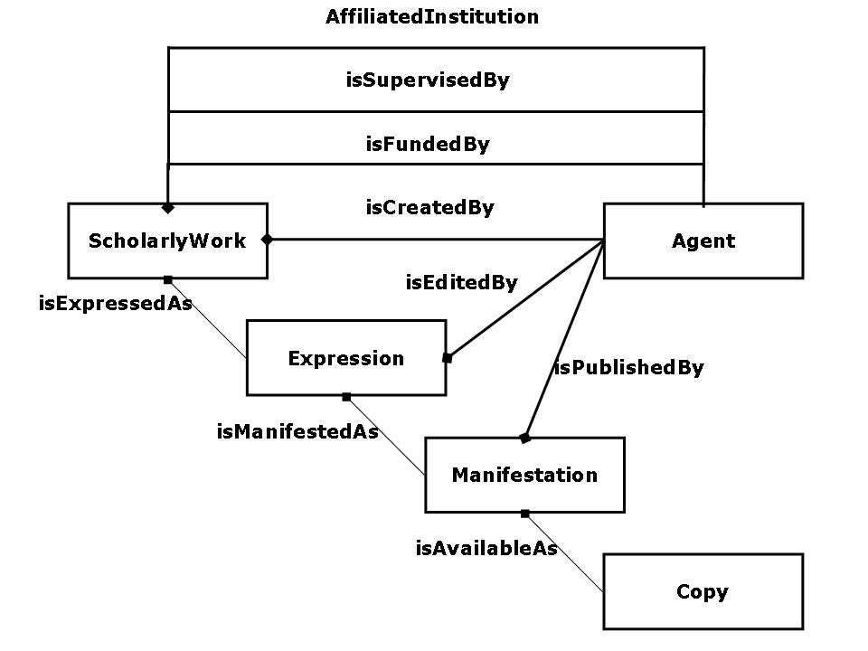

<!--#include virtual="/ssi/header.shtml" -->
# Guidelines for Dublin Core Application Profiles (Working Draft) (SUPERSEDED, SEE [CURRENT VERSION](/documents/profile-guidelines/))
<table class="docinfo" cellspacing="0">
  <tbody>
    <tr>
      <th>Creator:</th>
      <td>
        <a href="mailto:kcoyle@kcoyle.net">Karen Coyle</a> 
        Consultant</td>
    </tr>
    <tr>
      <th>Creator:</th>
      <td>
        <a href="mailto:tbaker@tbaker.de">Thomas Baker</a> 
        DCMI</td>
    </tr>
    <th>Date Issued:</th>
    <td>2008-xx-xx</td>
    <tr>
      <th>Identifier:</th>
      <td><a href="/documents/2008/xx/xx/dcap-guidelines/">http://dublincore.org/documents/2008/xx/xx/dcap-guidelines/</a></td>
    </tr>
    <tr>
      <th>Replaces:</th>
      <td>Not applicable</td>
    </tr>
    <tr>
      <th>Is Replaced By:</th>
      <td>Not applicable</td>
    </tr>
    <tr>
      <th>Latest Version:</th>
      <td><a href="/documents/dcap-guidelines/">http://dublincore.org/documents/dcap-guidelines/</a></td>
    </tr>
    <tr>
      <th>Description of Document:</th>
      <td>This document provides guidelines for the creation of
        Dublin Core Application Profiles. The document explains the
        key components of a Dublin Core Application Profile and walks
        through the process of developing a profile. The document
        is aimed at designers of application profiles -- people who
        will bring together metadata terms for use within a specific
        context. It does not address the creation of machine-readable
        implementations of an application profile nor the design of
        metadata applications in an broader sense. For additional
        technical detail the reader is pointed to further sources. This
        document represents work in progress.</td>
    </tr>
  </tbody>
</table>

* * *

## Table of contents

1. Introduction
2. Framework for Dublin Core Application Profiles
3. Defining Functional Requirements
4. Selecting or Developing a Domain Model
5. Selecting and Defining Metadata Terms
6. Designing the Metadata Record with a Description Set Profile
7. Usage Guidelines
8. Syntax Guidelines

* * *

## <a id="sect-1" name="sect-1">1. Introduction</a>

When it comes to metadata, one size does not fit all. In fact, one size often does not even fit many. The metadata needs of particular communities and applications are very diverse. The result is a great proliferation of metadata formats, even across applications that have metadata needs in common. The Dublin Core Metadata Initiative has addressed this by providing a framework for designing a Dublin Core Application Profile (DCAP) that meets specific application needs while providing semantic interoperability with other applications on the basis of globally defined vocabularies and models.

Note that a DCAP is a generic construct that does not require DCMI metadata terms [DCMI-MT]. While the approach originally developed as a means of specifying customized applications based on the fifteen elements of the Dublin Core Element Set (e.g., Title, Date, Subject), a DCAP can use _any_ terms that are defined in accordance with the RDF Vocabulary Description Language [RDFS], combining terms from different namespaces as needed.

Although the creation of an application profile requires effort, the return is better quality in the form of better guidance for metadata creators and improved consistency for application developers. By clearly specifying what is intended and expected in using the data, an application profile improves the opportunity to share data between communities.

### <a id="sect-2" name="sect-2">2. Framework for Dublin Core Application Profiles</a>

A DCAP is a document (or set of documents) that specifies and describes the metadata used in a particular application. To accomplish this, a profile:

- describes what a community wants to accomplish with its application (Functional Requirements);
- characterizes the types of things described by the metadata and their relationships (Domain Model);
- enumerates the metadata terms to be used and the rules for their use (Description Set Profile and Usage Guidelines); and
- defines the machine syntax that will be used to encode the data (Syntax Guidelines and Data Formats).

The interoperability of these components in a broader Web environment derives from their basis in more widely used "domain" standards: Community Domain Models, Metadata Vocabularies (from which the terms in the DCAP are chosen), the Dublin Core Abstract Model (a generic syntax for metadata records), and the DCMI Syntax Guidelines (for concrete application encodings). The foundation standard on which these domain standards rest is the Resource Description Framework (RDF) [RDF] of the World Wide Web Consortium.

The DCAP framework is illustrated in the Singapore Framework for Dublin Core Application Profiles, a framework for designing metadata applications for maximum interoperability and reusability. [DCMI-SF]

<table width="50%">
  <tbody>
    <tr>
      <td>
        

        <h5 align="center">Singapore Framework</h5>
      </td>
    </tr>
  </tbody>
</table>

The sections that follow describe the creation of a DCAP, presented in the upper section of the above diagram, in some detail. To illustrate the creation of a DCAP we will use an example of a simple application profile that describes a book and its author or authors. We'll call this example **MyBookCase**.

## <a id="sect-3" name="sect-3">3. Defining Functional requirements</a>

The purpose of any metadata is to support an activity. The development of clear goals for the application used in that activity is an essential first step.

Functional requirements guide the development of the application profile by providing goals and boundaries and are an essential component of a successful application profile development process. This development is often a broad community task and may involve managers of services, experts in the materials being used, technical application developers, and potential end-users of the services.

There are many methodologies to help in the creation of functional requirements, such as business process modeling, and methods for visualizing requirements, such as the Unified Modeling Language [UML]. Many find that the definition of use cases and scenarios for a particular application helps elicit functional requirements that might otherwise be overlooked.

Functional requirements answer questions such as:

- What do you want to accomplish with your application? 
- What are the limits of your application? What will it _not_ attempt to do? 
- How do you want the application you create to serve your users? 
- Will your application need to perform specific actions, such as sorting alphabetically or downloading data in particular formats?
- What are the key characteristics of your resources, and how does this affect your selection of data elements? For example, do you need to handle a variety of character sets?
- What are the key characteristics of your users? Are they associated with a particular institution or are you serving a general public? Do they all speak the same language? How expert are they in relation to the data your application will manage?
- Are there existing community standards that need to be considered?

Functional requirements can include general goals as well as specific tasks that you need to address. Ideally, functional requirements should address the needs of metadata creators, resource users, and application developers so that the resulting application fully supports the needs of the community.

These are some sample requirements from the Scholarly Works Application Profile (SWAP) [SWAP]:

> Facilitate identification of open access materials.  
> Enable identification of the research funder and project code.

A set of functional requirements may include user tasks that must be supported such as the following from the Functional Requirements for Bibliographic Records (FRBR) [FRBR]:

> Use the data to find materials that correspond to the user's stated search criteria.   
> Use the data retrieved to identify an entity.

For the MyBookCase DCAP our functional requirements are:

> Use the data to retrieve books with a **title** search.   
> Limit a search to a particular **language**.   
> Sort retrieved items by **publication date**.   
> Find items about a given **subject**.   
> Describe the **author** as a **person** with a **name** and **email address**.
## <a id="sect-4" name="sect-4">4. Selecting or Developing a Domain model</a>

After defining functional requirements, the next step is to select or develop a domain model. A domain model is a description of what _things_ (here: _resources_) your metadata will describe, the relationships between those things. The domain model is the basic blueprint for the construction of the application profile.

In the MyBookCase DCAP, our things are Books and Persons (i.e., authors of the books). We will see below how to describe the book (e.g., title and language) and the person (name and email address). For now, the domain model for our MyBookCase is simply:

Models can be even simpler than this (e.g., just a Book!), or they can be more complex The domain model for the Scholarly Works Dublin Core Application Profile, for example, is based on the library-community domain model Functional Requirements for Bibliographic Records (FRBR) [FRBR]:

 SWAP defines "Scholarly Work" in place of FRBR's more general entity "Work", and introduces new "Agent" relationships beyond those in the FRBR, such as "isFundedBy" and "isSupervisedBy." In this way, SWAP makes use of FRBR but customizes the FRBR model to meet its specific needs:<table width="445">
  <tbody>
    <tr>
      <td width="591"></td>
    </tr>
  </tbody>
</table>

## <a id="sect-5" name="sect-5">5. Selecting or Defining Metadata Terms</a>

As explained above, the entities in the domain model -- whether a Book and Author, Manifestation and Copy, or just a generic Resource -- are classes of things to be described in our metadata. The next step is to choose properties for describing them. For example, a Book has a **title** and an **author** ; a Person has a **name**.

The best (and easiest) option is to use properties from existing vocabularies, such as DCMI Metadata Terms [DCMI-MT] or the "Friend of a Friend" vocabulary [FOAF].

If the properties one needs are not already available, it is possible to declare one's own. Guidance for doing this can be found in "Cool URIs for the Semantic Web" [COOLURIS], the RDF Primer [RDF-PRIMER], and "Best Practice Recipes for Publishing RDF Vocabularies" [RECIPES]. Best-practice examples include DCMI Metadata Terms [DCMI-MT], Dublin Core Collection Description Terms [CTERMS], and Eprints Terms [ETERMS], It is good practice for terms also to be published in RDF schemas (see the schemas associated with DCMI Metadata Terms [DCMI-MT] and Dublin Core Collection Description Terms [CTERMS]).

When evaluating properties from an existing RDF vocabulary for use in your profile, take note of the following:

- In order to have a defined role in metadata based on the DCMI Abstract Model, terms must be formally identified as being "properties", "classes", or "datatypes" (Syntax Encoding Schemes) in the sense defined by the Resource Description Framework.
- In an RDF vocabulary, each property is identified with a Uniform Resource Identifier (URI). RDF properties are referenceable in a global context and are meant to be interpreted and processed the same way independently of the contexts in which they appear. This is indeed the reason why Dublin Core application profiles, by definition, do not themselves coin new properties, but only uses properties that have been defined outside of the profile and are, in principle, re-usable in other contexts.
- RDF vocabularies are usually provided with natural-language definitions. Designers of application profiles should take care to re-use terms from these vocabularies in ways that are compatible with these definitions. Application profiles may duplicate definitions, add technical constraints on use (such as repeatability), or provide more narrow interpretations of definitions for particular purposes, but they should not contradict their intended meaning.
- Emerging good practice for RDF vocabularies currently requires that properties be defined with a formal "domain" (a class of things that can be described by the property) and a "range" (a class of things that can be values). For example, the term <tt>foaf:img</tt> ("Image") has a domain of <tt>foaf:Person</tt> (so that one can infer that the thing being described with this property is a person) and a range of <tt>foaf:Image</tt> (so that one can infer that the value referred to by the property is an image). Formal domains and ranges improve the utility of RDF properties by enabling inferences about the things they are used to describe. For the purposes of re-using properties in application profiles, it is important to check whether or not a property has a range of <tt>rdfs:Literal</tt>:
  - Properties with a "literal" range, such as <tt>dcterms:date</tt> and<tt>dcterms:bibliographicCitation</tt>, are used with a value that is limited to just one value string, which may optionally be augmented with a language tag (in a "plain value string") or a datatype identifier (in a "typed value string"). The advantage of properties with a "literal" range is simplicity. The metadata carries -- and metadata-consuming applications expect -- just one plain or typed value string, making the metadata simple to encode and simple to process. In comparison with properties having a "non-literal" range, however, this simplicity comes at the price of flexibility and extensibility. When a property has a "literal" range, the metadata will be able to say the author is Mary Jones (using the value string "Mary Jones") but will have no way of carrying further information about Mary Jones, e.g. that she is a Person and has an email address or institutional affiliation. As literals cannot be the subject of any further statements, a literal value constitutes a final destination or "stopping point" in descriptive metadata.
  - In almost all cases, properties with ranges other than <tt>rdfs:Literal</tt> refer to "things" other than "strings". Examples of properties with a "non-literal" range include <tt>dcterms:license</tt>, with the range <tt>dcterms:LicenseDocument</tt>, and <tt>foaf:holdsAccount</tt>, with the range<tt>foaf:OnlineAccount</tt>. If a property has a "non-literal" range, the value can be represented by more than just one plain or typed value string. Potentially, the value can be represented by any combination of the following: 
    - Plain or typed value strings - not just one, but potentially several in parallel (e.g. a title rendered in English, French, and Japanese).
    - A URI identifying the value resource (Value URI).
    - A URI identifying an enumerated set (or controlled vocabulary) of which the value is a member.

End-users of metadata need not notice or care whether a property has a literal or non-literal range -- in an application interface, the string data presented to them may look the same regardless whether it is a "literal value" or a value string associated with a "non-literal value". However, this distinction has important consequences for the extensibility of metadata and for the form in which metadata is exchanged. Metadata-consuming applications like to know whether to expect value strings or URIs. For the price of some computational overhead for processing the "hook" on which the value strings and URIs are hung, the "non-literal value" offers better descriptive expressivity. In order to achieve the ideal of "linked metadata" -- descriptions that are cross-referenced using globally valid identifiers -- "non-literal" values are crucial because they support the use of URIs. "Non-literal" values can be the subjects of related descriptions. A Book was created by a Person, and that Person has a name and email address.

Now we are ready to select the properties for the MyBookCase application profile. We stated in our functional requirements that a Book will have a title, date, language, subject, and author:

- The **title** will be transcribed from the book itself. For this we can use the Dublin Core property<tt>dcterms:title</tt>, which has a "literal" range.
- We want to use the **date** property in various ways in our application, such as sorting a set of retrieved bibliographic records, so we want to be sure that dates are presented in a uniform way. We select the Dublin Core property <tt>dcterms:date</tt>, which has a "literal" range. Value strings will be formatted according to the W3C Date and Time Formats Specification, so we will use the Syntax Encoding Scheme URI <tt>http://purl.org/dc/terms/W3CDTF</tt>as a datatype.
- We want to indicate the **language** of the book so that users can limit their searches by language. The DCMI term <tt>dcterms:language</tt> suits this purpose well.
- It is important that languages be presented in a uniform manner. We achieve this by using value strings from the set of three-letter codes listed in the international standard ISO 639-3 for the representation of names of languages (such as "eng" for "English") together with the Syntax Encoding Scheme<tt>http://purl.org/dc/terms/ISO639-3</tt> as a datatype.
- We want to record the **subject**. Typically, we would indicate the subject with a value string, such as "Islam and Science", together a Vocabulary Encoding Scheme URI such as <tt>http://purl.org/dc/terms/LCSH</tt>, which identifies the heading "Islam and Science" as a member of the Library of Congress Subject Headings. However, we note that subject heading schemes are increasingly becoming available with their terms identified using citable URIs; the URI for "Islam and Science" in the prototype RDF vocabulary is <tt>http://lcsh.info/sh85068424#concept</tt>. The DCMI property <tt>dcterms:subject</tt> has a "non-literal" range, so flexibly supports the use of value strings, value URIs, and Vocabulary Encoding Scheme URIs as needed.
- We know that our **author** is going to be described in separate description within the metadata record. The author property will need to have a "non-literal" range so that it can be linked to the separate Person description. As mentioned above, the Dublin Core property<tt>dcterms:creator</tt> is defined as with a non-literal range, so we will use this in MyBookCase.
<table border="1" cellpadding="3" cellspacing="2" width="90%">
  <tbody>
    <tr>
      <th>Property</th>
      <th>Range</th>
      <th>Value String</th>
      <th>SES URI</th>
      <th>Value URI</th>
      <th>VES URI</th>
      <th>Related description</th>
    </tr>
    <tr>
      <td>dcterms:title</td>
      <td>literal</td>
      <td>YES</td>
      <td>no</td>
      <td bgcolor="grey"><i>not with a literal range</i></td>
      <td bgcolor="grey"><i>not with a literal range</i></td>
      <td bgcolor="grey"><i>not with a literal range</i></td>
    </tr>
    <tr>
      <td>dcterms:created</td>
      <td>literal</td>
      <td>YES</td>
      <td>YES [1]</td>
      <td bgcolor="grey"><i>not with a literal range</i></td>
      <td bgcolor="grey"><i>not with a literal range</i></td>
      <td bgcolor="grey"><i>not with a literal range</i></td>
    </tr>
    <tr>
      <td>dcterms:language</td>
      <td>non-literal</td>
      <td>YES</td>
      <td>YES [2]</td>
      <td>no</td>
      <td>no</td>
      <td>no</td>
    </tr>
    <tr>
      <td>dcterms:subject</td>
      <td>non-literal</td>
      <td>YES</td>
      <td>no</td>
      <td>YES</td>
      <td>YES [3]</td>
      <td>no</td>
    </tr>
    <tr>
      <td>dcterms:creator</td>
      <td>non-literal</td>
      <td>YES</td>
      <td>no</td>
      <td>no</td>
      <td>no</td>
      <td>YES</td>
    </tr>
  </tbody>
</table>
<pre>
[1] http://purl.org/dc/terms/W3CDTF
[2] http://purl.org/dc/terms/ISO639-2
[3] http://purl.org/dc/terms/LCSH
</pre>

The selection of properties for describing the Person follows the same model:

- The Person has a **name** , but we want to record the forename and family name separately rather than as a single string. DCMI Metadata Terms has no such properties, so we will take from the Friend of a Friend vocabulary [FOAF] the properties <tt>foaf:firstName</tt>and <tt>foaf:family_name</tt>.
- In order to record an email address as contact information for the Person, we will use the property <tt>foaf:mbox</tt>, which has a non-literal range, and use "mailto:" URIs as values.
<table border="1" cellpadding="3" cellspacing="2" width="90%">
  <tbody>
    <tr>
      <th>Property</th>
      <th>Range</th>
      <th>Value String</th>
      <th>SES URI</th>
      <th>Value URI</th>
      <th>VES URI</th>
      <th>Related description</th>
    </tr>
    <tr>
      <td>foaf:firstName</td>
      <td>literal</td>
      <td>YES</td>
      <td>no</td>
      <td bgcolor="grey"><i>not with a literal range</i></td>
      <td bgcolor="grey"><i>not with a literal range</i></td>
      <td bgcolor="grey"><i>not with a literal range</i></td>
    </tr>
    <tr>
      <td>foaf:family_name</td>
      <td>literal</td>
      <td>YES</td>
      <td>no</td>
      <td bgcolor="grey"><i>not with a literal range</i></td>
      <td bgcolor="grey"><i>not with a literal range</i></td>
      <td bgcolor="grey"><i>not with a literal range</i></td>
    </tr>
    <tr>
      <td>foaf:mbox</td>
      <td>non-literal</td>
      <td>no</td>
      <td>no</td>
      <td>YES [3]</td>
      <td>no</td>
      <td>no</td>
    </tr>
  </tbody>
</table>
<pre>
[1] using mailto: URIs
</pre>

Now we are ready to describe our metadata record.

## <a id="sect-6" name="sect-6">6. Designing the Metadata Record with a Description Set Profile</a>

Now we can describe the metadata record in detail. The DCMI Working Draft "Description Set Profiles: A constraint language for Dublin Core Application Profiles" [DSP] provides a method for specifying structural constraints on the descriptions and statements held in a metadata record. Such constraints specify, for example, whether a statement with a given property is repeatable or non-repeatable, optional or required. Description set profiles are based on the Description Set Model, part of the DCMI Abstract Model [DCAM], which is reproduced below in Appendix A. This section presents a simple Description Set Profile for MyBookCase.

A Description Set Profile (DSP) contains one _description template_ for each _thing_ in the domain model. The DSP for MyBookCase has two description templates -- one for Book and one for Person. Each description templates has _statement templates_ for the properties used to describe the Book or Person.

If each metadata record is to represent exactly one book, a book description template will occur once in each description set:

<pre>
DescriptionSet: MyBookCase
   Description template: Book
   minimum = 1; maximum = 1
</pre>

Let us say that each book must have one (and only one)_title_, which is identified with the property URI_http://purl.org/dc/terms/title_. Note that _title_is used in statements with literal values. Statement templates are created for each of the other properties used to describe a Book (with occurrence options and other constraints as needed):

<pre>
DescriptionSet: MyBookCase
   Description template: Book
   minimum = 1; maximum = 1
       Statement template: title
       minimum = 1; maximum = 1
         Property: http://purl.org/dc/terms/title
         Type of Value Surrogate = "literal"
       Statement template: dateCreated
       minimum = 0; maximum = 1
         Property: http://purl.org/dc/terms/created
         Type of Value Surrogate = "literal"
         Syntax Encoding Scheme URI = http://purl.org/dc/terms/W3CDTF
       Statement template: language
       minimum = 0; maximum = 3
         Property: http://purl.org/dc/terms/language
         Type of Value Surrogate = "non-literal"
         takes list = yes
         Syntax Encoding Scheme URI = http://purl.org/dc/terms/ISO639-2
       Statement template: author
       minimum = 0; maximum = 5 
         Property: http://purl.org/dc/terms/creator
         Type of Value Surrogate = "non-literal"
         defined as = person
</pre>

Notice that some of the properties have a minimum occurrence of 0 (zero). This is another way of saying that these properties are optional in our record, or that you can create a valid record even if these properties are not present. Some of them are repeatable, such as the language, which can occur as many as three times, and the author, which can occur as many as five times. We've defined the author as having the value of Person, which is described in its own description template.

<pre>
Description template: Person id=person
   minimum = 0; maximum = unlimited
   Statement template: givenName
     Property: http://xmlns.com/foaf/0.1/givenname
     minimum = 0; maximum = 1 
     Type of Value Surrogate = "literal"
   Statement template: familyName
     Property: http://xmlns.com/foaf/0.1/family_name
     minimum = 0; maximum = 1 
     Type of Value Surrogate = "literal"
   Statement template: email
     Property: http://xmlns.com/foaf/0.1/mbox
     minimum = 0; maximum = unlimited
     Type of Value Surrogate = "non-literal"
     value URI = mandatory
</pre>

A given Person can have one optional given name and one optional family name, each of which are literal strings. A Person can also have an email address which must be represented by a URI of the form "mailto:". Because many of us have more than one email address, we allow this statement to repeat as often as necessary.

We allow our Person to be used any number of times in the metadata record. This may seem to conflict with the fact that Person can only represent an author up to five times in the Book description, but we anticipate other possible uses for Persopn in our record, such as subjects of the Book, so we have chosen not to limit its number in the record in general.

Note that each Person description contains data elements for only one Person. This also means that an _author_statement will have only one Person value. If there are two authors, then two _author_ statements will be needed in the metadata record, each representing one Person. Note that one might allow a single Person to have more than one name, such as real names and pseudonyms; however, the metadata would clearly distinguish the case of multiple authors (multiple description templates) from that of a single author with multiple names (multiple statement templates).

If you wish to include an affiliated insitution for the_author_, you may want to create an institution description that contains the name and location of that institution, which will then link to the _author_description. You may also have other uses for corporate names and locations such as for recording information about the publisher of the book. As additional descriptions are created to hold the additional information, description sets can potentially become quite complex.

This completes the simple Description Set Profile for MyBookCase; see Appendix B for a version of this DSP encoded in XML.

## <a id="sect-7" name="sect-7">7. Usage Guidelines</a>

A Description Set Profile defines the "what" of the application profile; usage guidelines provide the "how" and "why". Usage guidelines offer instructions to the people who will create the metadata records, so ideally they should explain each property and anticipate the decisions that must be made in the course of creating a metadata record. Documentation for metadata creators presents some of the same information that is included in the DSP, but in a more human-understandable form. Those inputting metadata will need to know: is this required? is it repeatable? am I limited in the values that I can input in this statement? Oftentimes a user interface can answer these questions, for example by presenting the metadata creator with a list of valid values to choose from.

Some examples of the kinds of rules that might appear in usage guidelines are:

- For works of multiple authorship, the order of authors and how many to include (e.g. first 3, or no more than 20)
- How to determine document type using the prescribed document type vocabulary
- Definitions of minimum data entry
- Character sets, punctuation, and abbreviations to be used in strings

In some cases where usage guidelines are relatively simple, they may be included in the DSP document with the description of the property. The SWAP is an example where the guidance instructions are included in the same document that contains the Description Set Profile definition.

Other communities may have highly complex rules that are best presented as separate documents due to their length and complexity. For example, the Anglo-American Cataloguing Rules used as guidelines by some libraries are recorded in a 600-page book.[AACR2] Instructions relating to titles appear in numerous of the book's chapters and cover many pages of text. Guidelines of this length may not integrate well with the Description Set Profile definition.

## <a id="sect-8" name="sect-8">8. Syntax Guidelines</a>

The technologies described in this document are syntax neutral; that is, they do not require any particular machine-readable encoding syntax as long as the syntax employed can fully express the values and relationships defined in the DCAP.

To help developers turn their application profiles into functioning applications, DCMI has developed various encoding guidelines [DCMI-ENCODINGS]. Description Set Profiles can be deployed using any concrete implementation syntax for which a mapping to the abstract model has been specified. DCMI has developed or is developing guidelines for encoding DCAM-based metadata in HTML/XHTML, XML, and RDF/XML; others could be added in the future. There is no restriction on use of other types of syntax as long as the resulting data format is compatible with the foundation standards and with the Dublin Core Abstract Model.

&nbsp;

## References
<dl>

  <dt><a id="AACR2" name="AACR2"><strong>AACR2</strong></a></dt>
  <dd>American Library Association and Library Association, Anglo-American Cataloguing 
    Rules, 2nd ed. (London: Library Association, 1978).</dd>

  <dt><a id="CTERMS" name="CTERMS"> <strong>CTERMS</strong></a></dt>
  <dd>Dublin Core Collection Description Terms. 
  &lt;<a href="http://dublincore.org/groups/collections/collection-terms/2007-03-09/">http://dublincore.org/groups/collections/collection-terms/2007-03-09/</a>&gt; 
  See also RDF schema &lt;<a href="http://dublincore.org/groups/collections/collection-terms/2007-03-09/cldterms.rdf">
  http://dublincore.org/groups/collections/collection-terms/2007-03-09/cldterms.rdf</a>&gt;</dd>

  <dt><a id="COOLURIS" name="COOLURIS"> <strong>COOLURIS</strong></a></dt>
  <dd>Sauermann, Leo, Richard Cyganiak, eds. Cool URIs for the Semantic Web. 
  &lt;<a href="http://www.w3.org/TR/cooluris/">http://www.w3.org/TR/cooluris/</a>
</dd>

  <dt><a id="DCMI-ENCODINGS" name="DCMI-ENCODINGS"> <strong>DCMI-ENCODINGS</strong></a></dt>
  <dd>DCMI Encoding Guidelines 
    &lt;<a href="http://www.kcoyle.net/resources/expressions/">http://dublincore.org/resources/expressions/</a>&gt;</dd>

  <dt><a id="DCMI-MT" name="DCMI-MT"><strong>DCMI-MT</strong></a></dt>
  <dd>DCMI Metadata Terms. January, 2008.  
    &lt;<a href="http://dublincore.org/documents/dcmi-terms/">http://dublincore.org/documents/dcmi-terms/</a>&gt; 
    See also RDF schema &lt;<a href="http://dublincore.org/2008/01/14/dcterms.rdf">http://dublincore.org/2008/01/14/dcterms.rdf</a>&gt;</dd>

  <dt>
<strong>DCAM</strong>
</dt>
  <dd>Powell, Andy, Mikael Nilsson, Ambjörn Naeve, Pete Johnston and Thomas 
    Baker. DCMI Abstract Model. DCMI Recommendation. June 2007. 
    &lt;<a href="http://www.kcoyle.net/documents/2007/06/04/abstract-model/">http://dublincore.org/documents/2007/06/04/abstract-model/</a>&gt;</dd>

  <dt>
<strong>DCMI-SF</strong>
</dt>
  <dd>Nilsson, Mikael, Thomas Baker, Pete Johnston. The Singapore Framework for Dublin Core Application Profiles. 
  &lt;<a href="http://dublincore.org/documents/2008/01/14/singapore-framework/">http://dublincore.org/documents/2008/01/14/singapore-framework/</a>&gt;</dd>

  <dt>
<strong>DSP</strong>
</dt>
  <dd>Nilsson, Mikael. Description Set Profiles: A constraint language for Dublin Core Application Profiles. March, 2008. 
  &lt;<a href="http://dublincore.org/documents/2008/03/31/dc-dsp/">http://dublincore.org/documents/2008/03/31/dc-dsp/</a>&gt;</dd>

  <dt><a id="ETERMS" name="ETERMS"> <strong>ETERMS</strong></a></dt>
  <dd>Eprints Terms. 
  &lt;<a href="http://www.ukoln.ac.uk/repositories/digirep/index/Eprints_Terms">http://www.ukoln.ac.uk/repositories/digirep/index/Eprints_Terms</a>&gt;</dd>

  <dt>
<strong>FOAF</strong>
</dt>
  <dd>Brickley, Dan, Libby Miller. FOAF Vocabulary Specification 0.91. November, 2007 
  &lt;<a href="http://xmlns.com/foaf/spec/">http://xmlns.com/foaf/spec/</a>&gt;</dd>

  <dt>
<strong>FRBR</strong>
</dt>
  <dd> IFLA Study Group on the Functional Requirements for Bibliographic Records. 
  (1998). Functional Requirements for Bibliographic Records - Final Report. 
  Munich: K.G. Saur. Also available at 
  &lt;<a href="http://www.ifla.org/VII/s13/frbr/index.htm">http://www.ifla.org/VII/s13/frbr/index.htm</a>&gt;</dd>

  <dt>
<strong>RDF</strong> </dt>
  <dd> World Wide Web Consortium. Resource Description Framework 
  (RDF) &lt;<a href="http://www.w3.org/TR/rdf-concepts/">http://www.w3.org/RDF</a>&gt;</dd>

  <dt> <a id="RDFS" name="RDFS"><strong>RDFS</strong> </a>
</dt>
  <dd> Brickley, Dan and R.V. Guha, editors. RDF Vocabulary Description Language 
    1.0: RDF Schema. W3C Recommendation. 10 February 2004. 
    &lt;<a href="http://www.w3.org/TR/rdf-schema/">http://www.w3.org/TR/rdf-schema/</a>&gt;</dd>

  <dt>
<strong>RDF-PRIMER</strong>
</dt>
  <dd>Manola, Frank, Eric Miller. RDF Primer. W3C Recommendation 10 February 2004. 
  &lt;<a href="http://www.w3.org/TR/2004/REC-rdf-primer-20040210/">http://www.w3.org/TR/2004/REC-rdf-primer-20040210/</a>&gt;</dd>

  <dt><a id="RECIPES" name="RECIPES"><strong>RECIPES</strong></a></dt>
  <dd>Berrueta, Diego, Jon Phipps, eds. Best Practice Recipes for Publishing RDF Vocabularies. 
  &lt;<a href="http://www.w3.org/TR/swbp-vocab-pub/">http://www.w3.org/TR/swbp-vocab-pub/</a>&gt;</dd>

  <dt><a id="RFC3066" name="RFC3066"><strong>RFC3066</strong></a></dt>
  <dd>Alvestrand, H. Tags for the Identification of Languages. January, 2001.  
  &lt;<a href="http://www.ietf.org/rfc/rfc3066.txt">http://www.ietf.org/rfc/rfc3066.txt</a>&gt;
  </dd>

  <dt><a id="SWAP" name="SWAP"><strong>SWAP</strong></a></dt>
  <dd>Scholarly Works Application Profile.  
  &lt;<a href="http://www.ukoln.ac.uk/repositories/digirep/index/Eprints_Application_Profile">http://www.ukoln.ac.uk/repositories/digirep/index/Eprints_Application_Profile</a>&gt; 

  </dd>
<dt><a id="UML" name="UML"><strong>UML</strong></a></dt>
  <dd> Booch, Grady, James Rumbaugh and Ivar Jacobson. The Unified Modeling Language 
  User Guide. Addison-Wesley, 1998.</dd>

</dl>

### <a id="appa" name="appa">Appendix A</a>: Description Set Model (from DCMI Abstract Model)

According to the "Description Set Model" of the DCMI Abstract Model [DCAM], a Dublin Core _description set_ has the following structure:

- a _description set_ is made up of one or more _descriptions_
- a _description_ is made up of

  - zero or one _described resource URI_ and
  - one or more _statements_
- a _statement_ is made up of

  - exactly one _property URI_ and
  - exactly one _value surrogate_
- a _value surrogate_ is either a _literal value surrogate_ or a
_non-literal value surrogate_
  - a _literal value surrogate_ is made up of

    - exactly one _value string_
  - a _non-literal value surrogate_ is made up of

    - zero or one _value URIs_
    - zero or one _vocabulary encoding scheme URIs_
    - zero or more _value strings_
- a _value string_ is either a _plain value string_ or a _typed value string_

  - a _plain value string_ may be associated with a _value string language_
  - a _typed value string_ is associated with a _syntax encoding scheme URI_
- a _non-literal value_ may be described by another _description_.

### <a id="appb" name="appb">Appendix B</a>: MyBookCase Description Set Profile
<pre>
&lt;?xml version="1.0" encoding="UTF-8"?&gt;
&lt;DescriptionSetTemplate xmlns="http://dublincore.org/xml/dc-dsp/2008/01/14" 
    xmlns:xsi="http://www.w3.org/2001/XMLSchema-instance" 
    xsi:schemaLocation="http://dublincore.org/xml/dc-dsp/2008/01/14"&gt;
	&lt;DescriptionTemplate ID="Book" minOccurs="1" maxOccurs="1" standalone="yes"&gt;
		&lt;StatementTemplate ID="title" minOccurs="1" maxOccurs="1" type="literal"&gt;
			&lt;Property&gt;http://purl.org/dc/terms/title&lt;/Property&gt;
		&lt;/StatementTemplate&gt;
		&lt;StatementTemplate ID="dateCreated" minOccurs="0" maxOccurs="1" type="literal"&gt;
			&lt;Property&gt;http://purl.org/dc/terms/created&lt;/Property&gt;
			&lt;LiteralConstraint&gt;
				&lt;SyntaxEncodingScheme&gt;http://purl.org/dc/terms/W3CDTF&lt;/SyntaxEncodingScheme&gt;
			&lt;/LiteralConstraint&gt;
		&lt;/StatementTemplate&gt;
		&lt;StatementTemplate ID="language" minOccurs="0" maxOccurs="3" type="nonliteral"&gt;
			&lt;Property&gt;http://purl.org/dc/terms/language&lt;/Property&gt;
			&lt;NonLiteralConstraint&gt;
				&lt;VocabularyEncodingSchemeURI&gt;http://purl.org/dc/terms/ISO639-2&lt;/VocabularyEncodingSchemeURI&gt;
				&lt;ValueStringConstraint minOccurs="1" maxOccurs="1"/&gt;
			&lt;/NonLiteralConstraint&gt;
		&lt;/StatementTemplate&gt;
		&lt;StatementTemplate ID="author" minOccurs="0" maxOccurs="5" type="nonliteral"&gt;
			&lt;Property&gt;http://purl.org/dc/terms/creator&lt;/Property&gt;
			&lt;NonLiteralConstraint descriptionTemplateRef="person"/&gt;
		&lt;/StatementTemplate&gt;
	&lt;/DescriptionTemplate&gt;
	&lt;DescriptionTemplate ID="person" minOccurs="0" standalone="no"&gt;
		&lt;StatementTemplate ID="givenName" minOccurs="0" maxOccurs="1" type="literal"&gt;
			&lt;Property&gt;http://xmlns.com/foaf/0.1/givenname&lt;/Property&gt;
		&lt;/StatementTemplate&gt;
		&lt;StatementTemplate ID="familyName" minOccurs="0" maxOccurs="1" type="literal"&gt;
			&lt;Property&gt;http://xmlns.com/foaf/0.1/family_name&lt;/Property&gt;
		&lt;/StatementTemplate&gt;
		&lt;StatementTemplate ID="email" minOccurs="0" type="nonliteral"&gt;
			&lt;Property&gt;http://xmlns.com/foaf/0.1/mbox&lt;/Property&gt;
			&lt;NonLiteralConstraint&gt;
				&lt;ValueURIOccurrence&gt;mandatory&lt;/ValueURIOccurrence&gt;
			&lt;/NonLiteralConstraint&gt;
		&lt;/StatementTemplate&gt;
	&lt;/DescriptionTemplate&gt;
&lt;/DescriptionSetTemplate&gt;
</pre><!--#include virtual="/ssi/footer.shtml" -->
